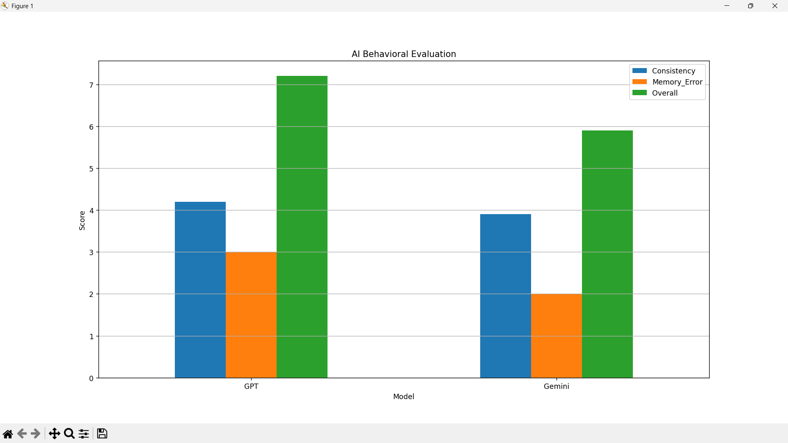

# AI Behavioral Evaluation (GPT vs Gemini)

This project explores how different AI models behave when evaluated across psychological-style metrics rather than just accuracy.

Instead of treating AI as a black box, I tried to break down its behavior into measurable components:
- Consistency of responses
- Memory retention
- Error detection and agreement patterns

## Approach

I designed a simple evaluation framework inspired by behavioral analysis:
- Ran multiple trials
- Assigned structured scores based on response patterns
- Converted observations into quantitative metrics

The idea was to move from *subjective impressions* → *measurable behavior*

## Tools Used
- Python
- Pandas
- Matplotlib

## Output
- Generated comparative bar graph using matplotlib
- Visualized:
  - Consistency
  - Memory Error
  - Overall Score

## Key Insight

The comparison shows that models may differ not just in correctness, but in *how they behave* — consistency, agreement tendencies, and memory handling all contribute to overall performance.

## Why this matters

Most AI comparisons focus on benchmarks.  
This project explores a more human-centered perspective:
> Can we evaluate AI like we evaluate cognitive behavior?

---

*Built as part of my interest in neuropsychology, cognition, and computational analysis.*
